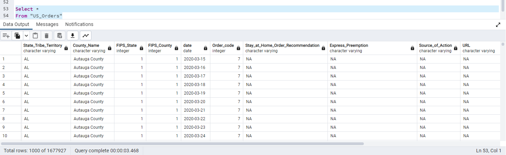
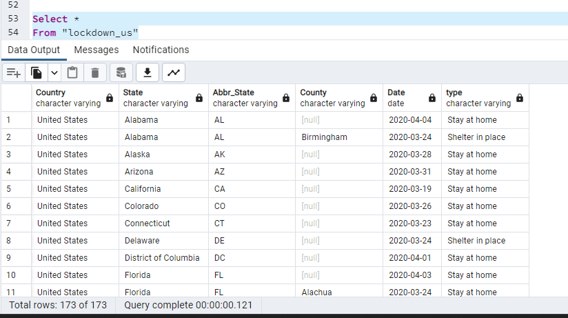

# COVID-19 Data Project

Investigating COVID-19 and Its Impact on Medical Conditions, Lockdowns, Vaccinations, and Demographic Data

## Team Members

* Anthony Bahena ([@antbahena](https://github.com/antbahena))
* Julian Diaz ([@JulianDiaz619](https://github.com/JulianDiaz619))
* Khanh Phan ([@khp023](https://github.com/khp023))
* Suneetha Chintala ([@SuniAnalytics](https://github.com/SuniAnalytics))

## Overview
The COVID-19 pandemic has affected the entire world in unprecedented ways. As the virus continues to spread, it is essential to understand its impact on different aspects of society, including medical conditions, lockdowns, vaccinations, and demographic data. Our team has chosen to investigate four different topics related to COVID-19 and explore how they impact the overall outcome of the pandemic.

## Project Objectives:
Our main objective is to analyze various aspects of COVID-19 and understand their impact on society. Specifically, we will address the following research questions:

*In what ways do pre-existing medical conditions of patients impact their likelihood of dying from COVID-19?
*What does the lockdown give us more insight on?
*Did COVID-19 activity decrease after vaccine distribution to the public?
*How does demographic data, such as age, gender, and race, correlate with COVID-19 outcomes?

## Methods
To answer these research questions, we will analyze various datasets related to COVID-19. We will use statistical analysis techniques to identify patterns and trends in the data and draw meaningful conclusions from our findings. Our initial approach will be finding datasets that meet our criteria with the appropriate keys. 

## Data Base (PG Admin)
#### Table 1

#### Table 2

## Expected Outcomes
We anticipate that our research will provide valuable insights into the impact of COVID-19 on various aspects of society. Our findings may inform public health policies and help healthcare providers better understand the risks associated with the virus.

## Conclusion
The COVID-19 pandemic has affected all aspects of our lives, and it is essential to understand its impact fully. Our team's research aims to explore different aspects of the pandemic and identify patterns and trends that can help us better understand the virus's impact on society. We hope that our findings will be useful for policymakers, healthcare providers, and the general public in navigating this unprecedented time.

## Status Update
Anthony made Tableau visualizations, Khanh built a COVID mortality prediction model using supervised machine learning, Suneetha used vaccination data to forecast next year's vaccination trends, and Julian attempted but couldn't build a machine learning model to predict COVID deaths due to insufficient relevant data.

## Sources
The data used in this project was provided by Centers for Disease Control and Prevention (CDC) and Kaggle at the following links: 
* [CDC | COVID-19 Case Surveillance Data](https://data.cdc.gov/Case-Surveillance/COVID-19-Case-Surveillance-Public-Use-Data-with-Ge/n8mc-b4w4)
* [CDC | Conditions Contributing to COVID-19 Deaths by State](https://data.cdc.gov/NCHS/Conditions-Contributing-to-COVID-19-Deaths-by-Stat/hk9y-quqm)
* [CDC | U.S. State and Territorial Stay-At-Home Orders](https://data.cdc.gov/Policy-Surveillance/U-S-State-and-Territorial-Stay-At-Home-Orders-Marc/y2iy-8irm)
* [Kaggle | United States COVID-19 Vaccinations](https://www.kaggle.com/datasets/sandhyakrishnan02/united-states-covid19-vaccinations)
* [Kaggle | US Lockdown Dates Dataset](https://www.kaggle.com/datasets/lin0li/us-lockdown-dates-dataset)

